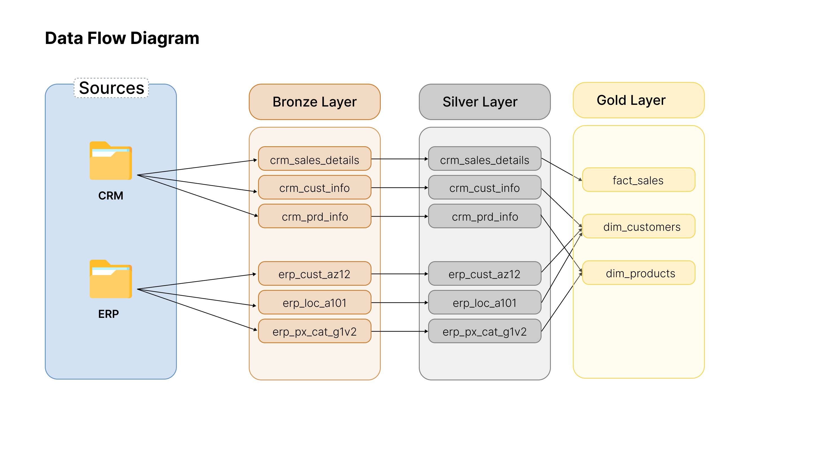
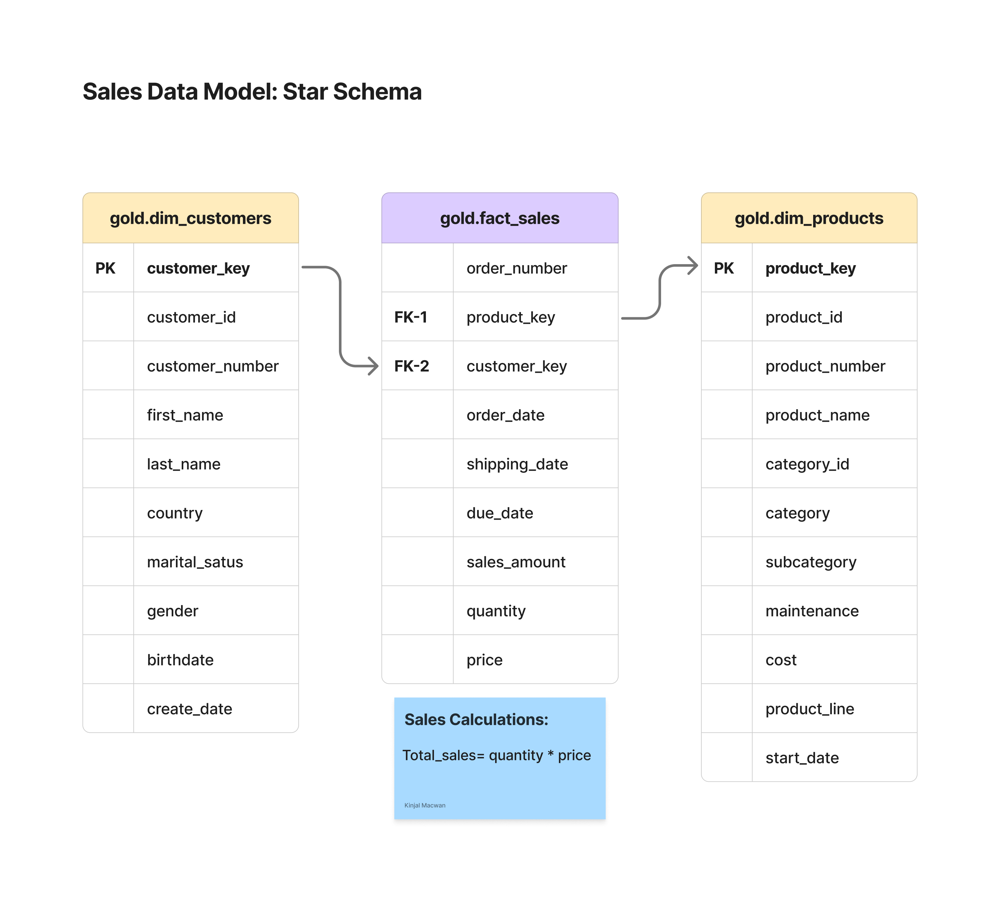

# 📊 Data Warehouse & Analytics Project

This project demonstrates an end-to-end data warehousing and analytics solution, covering the full lifecycle from raw data ingestion to building an optimized dimensional model and generating actionable business insights.

---
## 📖 Project Overview

This project involves:

1. **Data Architecture**: Designing a modern data warehouse using Medallion Architecture across Bronze, Silver, and Gold layers.
2. **Data Integration**: Merging disparate CRM and ERP operational datasets into a cohesive schema.
3. **ETL Pipelines**: Writing T-SQL scripts and stored procedures to extract, transform, and load data seamlessly.
4. **Data Modeling**: Developing optimized Fact (`fact_sales`) and Dimension (`dim_customers`, `dim_products`) tables.
5. **Analytics & Reporting**: Querying the Gold layer to extract business insights regarding customer behavior, product performance, and sales trends.

---
## 🏗️ Data Architecture

The data architecture for this project follows the **Medallion Architecture** (Bronze, Silver, and Gold layers):


1. **Bronze Layer**: Stores raw data as-is from source CSV files (ERP and CRM) into the SQL Server database without modification.
2. **Silver Layer**: Performs data cleansing, standardization, missing value handling, and normalization to prepare data for analytical processing.
3. **Gold Layer**: Houses business-ready data modeled into an optimized Star Schema (Fact and Dimension tables) ready for ad-hoc querying and reporting.

---


## 🔄 Data Flow & Integration Strategy

### System Integration Mapping
Data from CRM and ERP source systems is mapped and integrated before being transformed into the final schema:


### ETL Data Flow
The transition of data across the pipeline layers:



* **CRM System**: Ingests transactional records (`crm_sales_details`), product specs (`crm_prd_info`), and customer profiles (`crm_cust_info`).
* **ERP System**: Supplies supplemental attributes including product categories (`erp_px_cat_g1v2`), customer birthdates (`erp_cust_az12`), and geographic origins (`erp_loc_a101`).

---

## 📐 Data Modeling (Gold Layer)

The analytical Gold layer utilizes a **Star Schema** design to optimize query execution and simplify business reporting:



* **`gold.fact_sales`**: Transactional fact table containing metrics (`sales_amount`, `quantity`, `price`) and surrogate keys linking to dimension tables.
* **`gold.dim_customers`**: Unified customer profile table combining CRM demographic attributes with ERP location and birthdate data.
* **`gold.dim_products`**: Product dimension table enriching CRM product details with ERP category classifications.

---

## 🚀 Project Requirements

### Data Engineering
* **Data Sources**: Import raw CSV extracts from CRM and ERP operational systems.
* **Data Quality**: Resolve duplicate records, missing values, and formatting discrepancies in the Silver layer.
* **Integration**: Combine CRM and ERP sources into a single Star Schema model.
* **Documentation**: Maintain a clear data catalog and naming conventions in `docs/`.

### Analytics & BI
* Execute T-SQL analytical queries on the Gold layer to evaluate:
  * **Customer Behavior**: Demographic segments, order frequencies, and location breakdowns.
  * **Product Performance**: Top-selling products, category performance, and profit margins.
  * **Sales Trends**: Order volumes and revenue performance over time.

---

## 📂 Repository Structure

```text
sql-data-warehouse-project/
│
├── datasets/                            # Raw source CSV files (ERP and CRM)
│
├── docs/                                # Documentation and architecture diagrams
│   ├── Data_architecture.jpg            # High-level Medallion Architecture diagram
│   ├── data_flow.png                    # Layer-by-layer data flow diagram
│   ├── data_Integration.png             # CRM and ERP entity mapping diagram
│   ├── data_model_star_schema.png       # Gold layer Star Schema ERD
│   ├── data_catalog.md                  # Metadata catalog and field descriptions
│   └── naming_conventions.md            # Guidelines for table and column naming
│
├── scripts/                             # T-SQL scripts and stored procedures
│   ├── bronze/                          # Bulk ingestion and raw DDL scripts
│   ├── silver/                          # Cleansing and transformation scripts
│   ├── gold/                            # Star schema views and dimensional models
│   └── init_database.sql                # Database and schema initialization script
│
├── tests/                               # Data quality checks and validation SQL scripts
│   └── quality_checks_silver.sql        # Null checks, uniqueness, and constraint validation
│
├── README.md                            # Main project overview and setup guide
└── LICENSE                              # Project license
